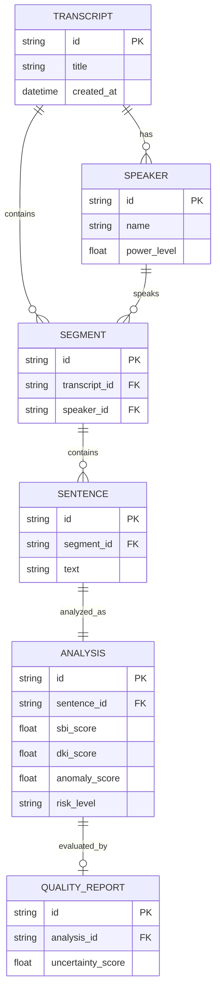
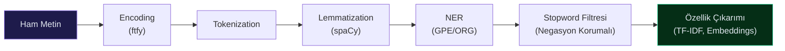
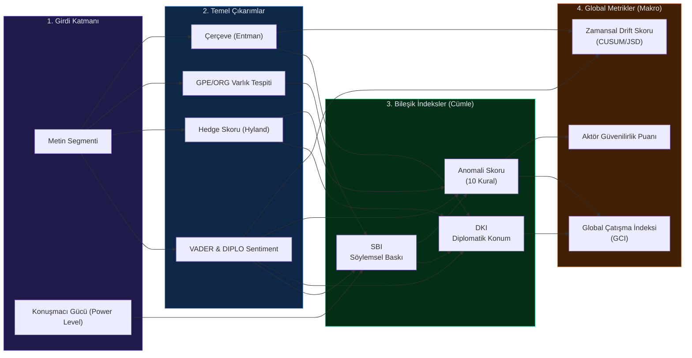
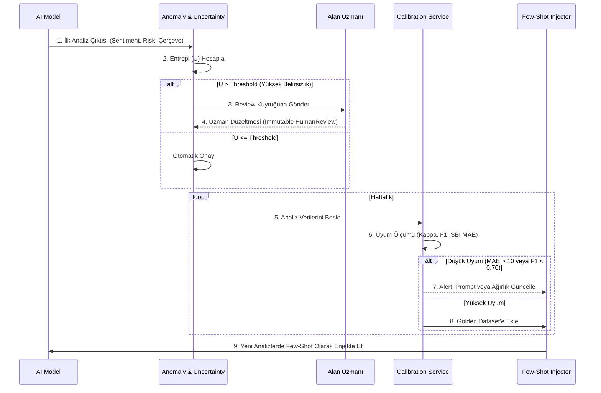

<div align="center">


<br/>

[](https://github.com/BBgitaccount/BB-PAXDATA)
[](https://www.python.org/)
[](./LICENSE)
[](./tests)
[](./pyproject.toml)

---

*Diplomatik transkriplerin yapısal çıkarımı, çok katmanlı anotasyonu ve kantitatif çerçeveleme analizi için geliştirilmiş **açık kaynaklı NLP motoru**.*

> [!WARNING]
> **Bu döküman v1.0.0'e özeldir.** Sistem geliştikçe API'ler, formüller ve mimariler önemli ölçüde değişebilir. Güncel bilgi için her zaman etiketli sürümün dökümantasyonuna başvurun.

</div>

---

## 📋 İçindekiler

| # | Bölüm |
|---|-------|
| 1 | [Hızlı Başlangıç Kılavuzu](#1-hızlı-başlangıç-kılavuzu) |
| 2 | [Sistem Genel Bakış](#2-sistem-genel-bakış) |
| 3 | [Mimari](#3-mimari) |
| 4 | [Analitik Pipeline](#4-analitik-pipeline) |
| 5 | [Domain Servisleri — Teknik Detaylar](#5-domain-servisleri--teknik-detaylar) |
| 6 | [Analiz Çıktıları ve Metrik Hiyerarşisi](#6-analiz-çıktıları-ve-metrik-hiyerarşisi) |
| 7 | [Kalite Güvencesi ve HITL](#7-kalite-güvencesi-ve-hitl) |
| 8 | [Altyapı ve Gözlemlenebilirlik](#8-altyapı-ve-gözlemlenebilirlik) |
| 9 | [Bilimsel Metodoloji ve Kaynaklar](#9-bilimsel-metodoloji-ve-kaynaklar) |

---

## 1. Hızlı Başlangıç Kılavuzu

> [!NOTE]
> Bu bölüm, sistemi sıfırdan kuracak ve analizleri tetikleyecek geliştiriciler / araştırmacılar için adım adım bir rehberdir.

### Gereksinimler
- **Python** $\geq$ 3.12
- **Poetry** $\geq$ 1.8
- *(Opsiyonel)* **Docker** (İzleme ve loglama için)

### Kurulum

```bash
# 1. Repoyu klonla
git clone https://github.com/BBgitaccount/BB-PAXDATA.git
cd BB-PAXDATA

# 2. Ortam değişkenlerini yapılandır (Bkz. .env.example)
cp .env.example .env

# 3. Bağımlılıkları kur ve sanal ortama geç
poetry install
poetry shell

# 4. Veritabanı tablolarını oluştur
alembic upgrade head
```

### İlk Analizi Çalıştırma

CLI üzerinden sistemle doğrudan etkileşime geçebilirsiniz:

```bash
# Ham transkripti veritabanına al
bbpaxdata build --transcript data/sample_transcript.json

# Cümle bazlı NLP/AI analizini tetikle
bbpaxdata analyze --transcript-id <id>

# Anomali ve risk denetimini HTML formatında raporla
bbpaxdata failcheck --report-format html
```

---

## 2. Sistem Genel Bakış

BB-PAXDATA, konferans tutanakları veya zirve konuşmaları gibi diplomatik metinleri alır; duygu (sentiment), risk, çit (hedge) dili ve çerçeveleme (framing) gibi birçok boyutta analiz eder. Bu süreç 5 temel katmanda gerçekleşir:


---

## 3. Mimari

Sistem bileşenlerinin ve tabloların ilişkisi aşağıdaki Entity-Relationship diyagramında gösterilmiştir.



---

## 4. Analitik Pipeline

Ham metin sisteme girdikten sonra ön işleme aşamasından geçer:



---

## 5. Domain Servisleri — Teknik Detaylar

> [!IMPORTANT]
> Bu bölümde sistemde kullanılan indekslerin formülleri açıklanmaktadır. Github'ın Markdown render sürecinde formüllerin bozulmaması için `\text{...}` bloklarında alt çizgiler (`_`) alt simge (subscript) olarak kodlanmıştır.

### 5.1 Duygu Analizi (`SentimentService`)

Sistem, diplomatik söylemler için özelleştirilmiş **DIPLO leksikonu** ile VADER'ı birleştirir.

Saf DIPLO skoru:
$$\text{diplo}_{\text{compound}} = \text{VADER}_{\text{compound}} + \left(\sum_{p \in \text{matched}_{\text{phrases}}} v_p\right) \times 0.05$$

**Negasyon-Farkında Skor** *(Jia & Liang, 2017)*:
$$\text{score}_{\text{neg-aware}} = \begin{cases}
-v_p \times 0.8 & \text{eğer } \exists \; n \in \text{NEGATION}_{\text{WORDS}} \; \text{window}[i-4:i] \\
v_p & \text{aksi hâlde}
\end{cases}$$

### 5.2 Risk Puanlama (`RiskService`)

İki adet bileşik indeks hesaplanır:

1. **SBI (Söylemsel Baskı İndeksi):** Güç düzeyi ve talep ağırlığına dayanır.
   $$\text{SBI} = \frac{P_{\text{level}} \times W_{\text{demand}}}{2} + R_{\text{score}}$$

2. **DKI (Diplomatik Konum İndeksi):** Nihai diplomatik duruş skoru. $[-1, 1]$
   $$\text{DKI} = \Big(d_{\text{norm}} \cdot 0.4 + (1 - r_{\text{norm}}) \cdot 0.3 + d_{\text{req}} \cdot 0.2 + (1 - m_{\text{norm}}) \cdot 0.1\Big) \times 2 - 1$$

### 5.3 Çapraz Anomali Tespiti (`CrossAnomalyService`)

Tsytsarau (2017) çelişki formülü baz alınarak **10 farklı kural seti** ile anomali skoru hesaplanır:
$$C = \frac{n \cdot M_2 - M_1^2}{\left(\vartheta \cdot n^2 + M_1^2\right) \cdot W}$$

---

## 6. Analiz Çıktıları ve Metrik Hiyerarşisi

Sistemdeki verilerin ham halden global endekslere nasıl dönüştüğünü gösteren metrik hiyerarşisi:



---

## 7. Kalite Güvencesi ve HITL

Yapay zeka analizlerinin kalibrasyonu ve iyileştirilmesi için sisteme entegre, tam teşekküllü bir **Human-in-the-Loop (İnsanın Döngüye Katılımı)** mekanizması vardır.

### 7.1 HITL Yaşam Döngüsü



> [!TIP]
> **Belirsizlik (Uncertainty) Formülü:**
> $$U = H(p) = -\sum_{c} p_c \log_2 p_c$$
> AI modelinin kategori tahmin olasılıkları ($p_c$) arasındaki entropidir.

---

## 8. Altyapı ve Gözlemlenebilirlik

### 8.1 Fallback (Yedeklilik) ve JSON Kurtarma
Farklı AI backend'leri arasında (Ollama, Anthropic, Gemini, Groq) otomatik fallback (düşüş) sistemi vardır. LLM'in ürettiği bozuk JSON çıktıları için **6-Aşamalı Kurtarma Motoru (Recovery Engine)** devreye girer.

### 8.2 İzleme (Prometheus & Grafana)
Uygulama metrikleri (latency, önbellek vurma oranı, JSON kurtarma istatistikleri) düzenli olarak Prometheus üzerinden toplanır ve Grafana'da analiz edilir.

---

## 9. Bilimsel Metodoloji ve Kaynaklar

Sistem tamamen bilimsel temellere ve makalelere dayanmaktadır:

- **Sentiment:** Socher et al. (2013), Jia & Liang (2017) — Negasyon-farkında VADER + DIPLO Leksikonu.
- **Risk:** Baldwin (1985), Fearon (1995), Trager (2010) — Zorlayıcı Diplomasi ve Cheap Talk.
- **Hedging:** Hyland (1995, 2005) — Epistemik metadiscourse taksonomisi.
- **Framing:** Entman (1993) — Dört fonksiyonlu (Problem, Neden, Ahlak, Çözüm) çerçeveleme.
- **Anomaly:** Tsytsarau et al. (2017) — Duygu tabanlı çelişki tespiti.
- **Temporal Drift:** Page (1954), Lin (1991) — CUSUM tabanlı drift ve Jensen-Shannon Divergence.

<br/>

<div align="center">


**[⬆ Başa Dön](#-i̇çindekiler)**

</div>
