<div align="center">

# BB-PAXDATA


<br/>

[](https://github.com/BBgitaccount/BB-PAXDATA)
[](https://www.python.org/)
[](./LICENSE)
[](./tests)
[](./pyproject.toml)
[](./mypy.ini)

---

*Diplomatik transkriplerin yapısal çıkarımı, çok katmanlı anotasyonu ve kantitatif çerçeveleme analizi için geliştirilmiş **açık kaynaklı NLP motoru**.*

> [!WARNING]
> **Bu döküman v1.0.0'e özeldir.** Sistem geliştikçe API'ler, formüller ve mimariler önemli ölçüde değişebilir. Güncel bilgi için her zaman etiketli sürümün dökümantasyonuna başvurun.

</div>

---

## 📋 İçindekiler

| # | Bölüm |
|---|-------|
| 1 | [Hızlı Başlangıç Kılavuzu](#1-hızlı-başlangıç-kılavuzu) |
| 2 | [Sistem Genel Bakış](#2-sistem-genel-bakış) |
| 3 | [Mimari](#3-mimari) |
| 4 | [Analitik Pipeline](#4-analitik-pipeline) |
| 5 | [Domain Servisleri — Teknik Detaylar](#5-domain-servisleri--teknik-detaylar) |
| 6 | [Analiz Çıktıları ve Metrik Hesaplamaları](#6-analiz-çıktıları-ve-metrik-hesaplamaları) |
| 7 | [Kalite Güvencesi ve HITL](#7-kalite-güvencesi-ve-hitl) |
| 8 | [Altyapı](#8-altyapı) |
| 9 | [Gözlemlenebilirlik](#9-gözlemlenebilirlik) |
| 10 | [CLI Referansı](#10-cli-referansı) |
| 11 | [Bilimsel Metodoloji](#11-bilimsel-metodoloji) |
| 12 | [Akademik Kaynaklar](#12-akademik-kaynaklar) |

---

## 1. Hızlı Başlangıç Kılavuzu

> [!NOTE]
> Bu bölüm, BB-PAXDATA'yı sıfırdan kuracak ve çalıştıracak geliştiriciler/araştırmacılar için adım adım bir kılavuzdur. Analizleri başlatmak için önce ortamın hazırlanması gerekir.

### 1.1 Gereksinimler

| Gereksinim | Versiyon | Zorunlu? |
|------------|---------|---------|
| Python | $\geq$ 3.12 | ✅ |
| Poetry | $\geq$ 1.8 | ✅ |
| Docker + Docker Compose | Herhangi | İzleme için (Opsiyonel) |
| Ollama | Herhangi | Yerel LLM için (Opsiyonel) |

### 1.2 Kurulum

```bash
# 1. Repoyu klonla
git clone https://github.com/BBgitaccount/BB-PAXDATA.git
cd BB-PAXDATA

# 2. Environment dosyasını oluştur
cp .env.example .env
# .env dosyasını düzenle — AI API anahtarlarını ekle
```

**.env Dosyası Yapılandırması (Örnek):**
```ini
# AI Backend Anahtarları (en az biri gerekli)
OLLAMA_BASE_URL=http://localhost:11434   # Yerel LLM için (ücretsiz)
ANTHROPIC_API_KEY=your_claude_key       # Claude için
GEMINI_API_KEY=your_gemini_key          # Google Gemini için
GROQ_API_KEY=your_groq_key              # Hızlı çıkarım için

# Veritabanı ve Önbellek
DATABASE_URL=sqlite:///./data/paxdata.db
CACHE_BACKEND=diskcache
CACHE_DIR=./data/cache
```

```bash
# 3. Bağımlılıkları kur ve sanal ortama geç
poetry install
poetry shell

# 4. Veritabanı tablolarını oluştur
alembic upgrade head
```

### 1.3 İlk Analizi Çalıştırma

CLI üzerinden analiz pipeline'ını kolayca tetikleyebilirsiniz:

```bash
# Ham transkripti veritabanına al
bbpaxdata build --transcript data/sample_transcript.json

# Cümle bazlı NLP/AI analizini tetikle
bbpaxdata analyze --transcript-id <id>

# Anomali ve risk denetimini HTML rapor olarak çıkar
bbpaxdata failcheck --report-format html
```

---

## 2. Sistem Genel Bakış

BB-PAXDATA, diplomatik söylemleri (konferans tutanakları, zirve konuşmaları, BM oturumları vb.) çok boyutlu biçimde analiz eden bir **NLP boru hattıdır**. Sistem; duygu analizi, risk puanlama, çit (hedge) dili tespiti, çerçeveleme analizi ve anomali tespitini tek bir bütünleşik motorun altında toplar.

Aşağıdaki şema, sistemin 5 temel katmanındaki veri akışını ve sorumlulukları göstermektedir:

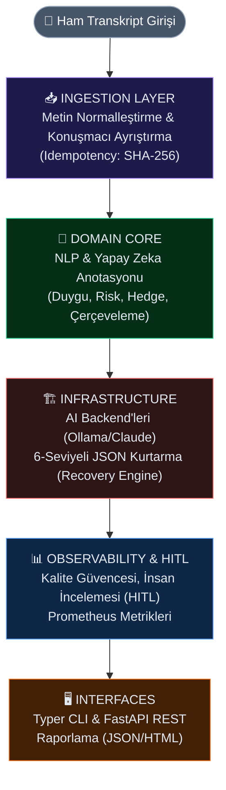

### Katman Sorumlulukları

| Katman | Sorumluluk | Çıktı |
|--------|------------|-------|
| **Ingestion** | Transkript normalleştirme, konuşmacı ayrıştırma, idempotency | `Segment[]`, `Speaker[]` |
| **Domain Core** | NLP anotasyonu (duygu, risk, hedge, çerçeve, anomali) | `Analysis` (cümle başına) |
| **Infrastructure** | Persistans, AI backend soyutlaması, önbellekleme, kurtarma | Alembic-versioned DB, önbellek |
| **Observability** | Metrikler, izleme, prompt versiyonlama | Prometheus + Grafana |
| **Quality Assurance** | Altın veri seti değerlendirmesi, belirsizlik puanlama, drift tespiti | `QualityReport`, `UncertaintyScore` |
| **Interface** | CLI (`typer`) + gelecek REST API (`FastAPI`) | Okunabilir raporlar & yapısal export |

---

## 3. Mimari

### 3.1 Genel Mimari — Katmanlı Görünüm

```mermaid
graph TB
    subgraph INTERFACES["🖥️ INTERFACES"]
        CLI["CLI (Typer + Rich)"]
        API["Future: FastAPI REST"]
    end

    subgraph APPLICATION["⚙️ APPLICATION"]
        CMD_BUILD["BuildDatabaseCommand"]
        CMD_ANALYZE["RunAnalysisCommand"]
        CMD_FAIL["RunFailCheckCommand"]
        QUERIES["Query Objects"]
        PIPELINE["AnalysisPipeline"]
        CONSENSUS["ConsensusService"]
    end

    subgraph DOMAIN["🧠 DOMAIN CORE"]
        SENTIMENT["SentimentService\n(DIPLO + VADER)"]
        RISK["RiskService\n(SBI + DKI)"]
        HEDGING["HedgingService\n(Hyland 1995)"]
        FRAMING["FramingService\n(Entman 1993)"]
        ANOMALY["CrossAnomalyService\n(10 Kural)"]
        TOPIC["TopicService\n(TF-IDF + BERTopic)"]
        TEMPORAL["TemporalAnalyzer\n(CUSUM + JSD)"]
        NER["NERService\n(spaCy GPE/ORG)"]
    end

    subgraph INFRA["🏗️ INFRASTRUCTURE"]
        DB["SQLAlchemy 2.0 async\n+ Alembic"]
        AI["AI Clients\n(Ollama/Claude/Gemini/Groq)"]
        CACHE["Cache\n(DiskCache + Redis)"]
        RECOVERY["6-Level JSON\nRecovery Engine"]
        OBS["Observability\n(Prometheus)"]
        QUALITY["Quality\n(DeepEval + Golden DS)"]
    end

    subgraph CONFIG["⚙️ CONFIG"]
        SETTINGS["Pydantic Settings\n(.env)"]
        LOGGING["Structlog"]
    end

    INTERFACES --> APPLICATION
    APPLICATION --> DOMAIN
    APPLICATION --> INFRA
    DOMAIN --> INFRA
    INFRA --> CONFIG

    style INTERFACES fill:#1e1b4b,stroke:#a78bfa,color:#e2e8f0
    style APPLICATION fill:#0f2746,stroke:#60a5fa,color:#e2e8f0
    style DOMAIN fill:#052e16,stroke:#34d399,color:#e2e8f0
    style INFRA fill:#2d1515,stroke:#f87171,color:#e2e8f0
    style CONFIG fill:#1c1917,stroke:#a3a3a3,color:#e2e8f0
```

### 3.2 Veri Akışı — Cümle Düzeyinde Pipeline

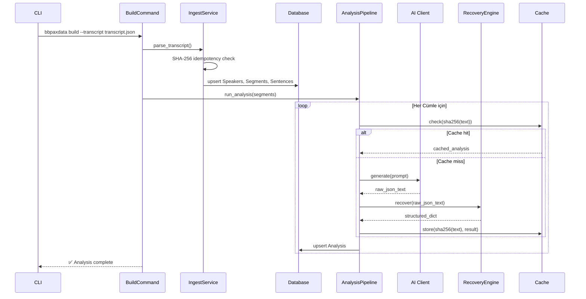

### 3.3 Domain Model — Varlık İlişkisi

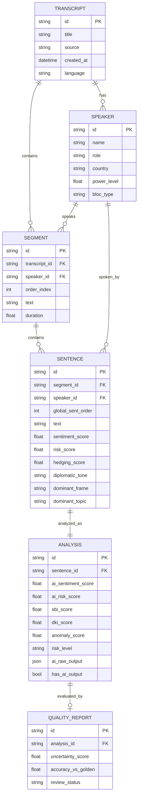

---

## 4. Analitik Pipeline

### 4.1 Ön İşleme (Pre-processing)

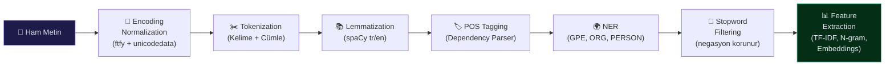

| Adım | Yöntem | Amaç |
|------|--------|-------|
| Tokenization | Kelime + cümle düzeyi | Tüm downstream görevler için temel |
| Encoding Normalization | `ftfy` + `unicodedata` | Türkçe/Arapça/Kiril mojibake düzeltme |
| Lemmatization | spaCy (`tr_core_news_trf`, `en_core_web_trf`) | Morfolojik varyantları standartlaştırma |
| POS Tagging | spaCy dependency parser | Sözdizimsel özellik çıkarımı |
| NER | spaCy + özel GPE modeli | Jeopolitik varlık tespiti |
| Stopword Filtering | Alan-farkında (negasyon *not*, *never* korunur) | Retorik açıdan yüklü token'ları koruma |

### 4.2 Özellik Çıkarımı

| Özellik | Teknik | Granülarlik |
|---------|--------|-------------|
| TF-IDF | Scikit-learn / özel | Segment düzeyinde anahtar kelime sıralaması |
| N-gram | Bigram / trigram frekansı | Collocation & retorik örüntü tespiti |
| Embeddings | Bağlamsal (transformer tabanlı) | Semantik benzerlik & kümeleme |

---

## 5. Domain Servisleri — Teknik Detaylar

> [!IMPORTANT]
> Bu bölümde sistemde kullanılan indekslerin bilimsel formülleri açıklanmaktadır. Github'ın LaTeX Markdown render sürecinde formüllerin bozulmaması için `\text{...}` bloklarındaki alt çizgiler özenle kodlanmıştır.

### 5.1 Duygu Analizi (`SentimentService`)

Sistem, diplomatik söylemler için özelleştirilmiş **DIPLO leksikonu** ile VADER'ı birleştirir.

#### Temel Formül
Saf DIPLO skoru şu şekilde hesaplanır:

$$\text{diplo}_{\text{compound}} = \text{VADER}_{\text{compound}} + \left(\sum_{p \in \text{matched}_{\text{phrases}}} v_p\right) \times 0.05$$

Burada $v_p \in [-0.9, +0.7]$ aralığında diplomatik değerlik puanlarıdır. Sonuç $[-1, 1]$ aralığına sıkıştırılır.

#### Negasyon-Farkında Skor
Sol-pencere negasyon tespiti *(Jia & Liang, 2017)*:

$$\text{score}_{\text{neg-aware}} = \begin{cases}
-v_p \times 0.8 & \text{eğer } \exists \; n \in \text{NEGATION}_{\text{WORDS}} \; \text{window}[i-4:i] \\
v_p & \text{aksi hâlde}
\end{cases}$$

Burada $0.8$ attenuation (zayıflatma) faktörüdür.

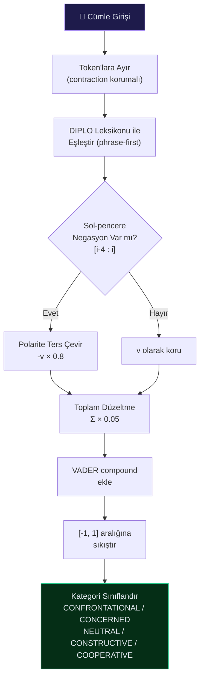

**Duygu Eşikleri:**
| Skor Aralığı | Kategori |
|-------------|---------|
| $s \leq -0.40$ | `CONFRONTATIONAL` |
| $-0.40 < s \leq -0.10$ | `CONCERNED` |
| $-0.10 < s < 0.10$ | `NEUTRAL_CAUTIOUS` |
| $0.10 \leq s < 0.35$ | `CONSTRUCTIVE` |
| $s \geq 0.35$ | `COOPERATIVE` |

---

### 5.2 Risk Puanlama (`RiskService`)

Sistem iki adet bileşik indeks hesaplar: **SBI** (Söylemsel Baskı İndeksi) ve **DKI** (Diplomatik Konum İndeksi).

#### SBI — Söylemsel Baskı İndeksi
$$\text{SBI} = \frac{P_{\text{level}} \times W_{\text{demand}}}{2} + R_{\text{score}}$$

Burada:
- $P_{\text{level}} \in [0, 10]$: Konuşmacının güç düzeyi
- $W_{\text{demand}} \in [0, 1]$: Talebin ağırlığı (*suggest*=0.5, *should*=0.7, *must/demand*=0.9)
- $R_{\text{score}} \in [0, 10]$: Baz risk skoru

#### DKI — Diplomatik Konum İndeksi
$$\text{DKI} = \Big(d_{\text{norm}} \cdot 0.4 + (1 - r_{\text{norm}}) \cdot 0.3 + d_{\text{req}} \cdot 0.2 + (1 - m_{\text{norm}}) \cdot 0.1\Big) \times 2 - 1$$

Burada:
- $d_{\text{norm}}$: Normalize diplomatik skor $\in [0, 1]$
- $r_{\text{norm}}$: Normalize risk skoru $\in [0, 1]$
- $d_{\text{req}}$: Normalize talep yoğunluğu $\in [0, 1]$
- $m_{\text{norm}}$: Normalize manipülasyon skoru $\in [0, 1]$

Sonuç: $\text{DKI} \in [-1, 1]$ (−1 = tam düşmanca, +1 = tam işbirlikçi).

#### Bağlamsal Risk (NER Çarpanı)
$$R_{\text{ctx}} = \min\!\left(10,\; R_{\text{base}} \times \mu\right)$$

$$\mu = \begin{cases} 1.5 & \text{GPE veya ORG varlığı tespit edilirse} \\ 1.2 & \text{yalnızca PERSON varlığı tespit edilirse} \\ 1.0 & \text{varlık yok} \end{cases}$$

**Risk Sinyal Ağırlıkları:**
| Kategori | Örnekler | Puan |
|----------|---------|------|
| CRITICAL | *red line*, *ultimatum*, *unacceptable*, *military option* | 3 |
| HIGH | *escalate*, *retaliate*, *decisive actions*, *deep strikes* | 2 |
| BASE | Diğer tüm sinyal kelimeleri | 1 |

---

### 5.3 Çit (Hedge) Dili Analizi (`HedgingService`)

**Hyland (1995, 2005)** taksonomisine dayanan epistemic ve stil hedge kategorileri:

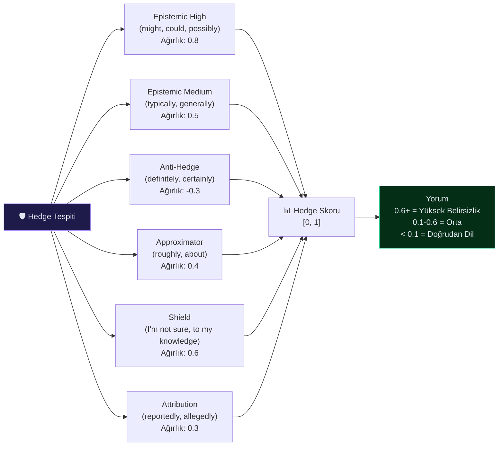

#### Hedge Yoğunluk Formülü
$$H_{\text{score}} = \frac{\sum_{c \in \text{categories}} w_c \cdot n_c}{\max(1, N_{\text{matches}})}$$

---

### 5.4 Çerçeveleme Analizi (`FramingService`)

**Entman (1993)** dört-fonksiyonlu çerçeveleme modelini uygular:

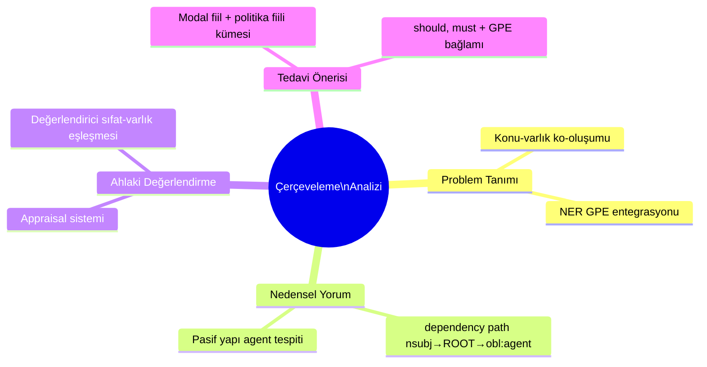

**Çerçeve Türleri (v1.0.0):**
| Frame Türü | Tanımı |
|-----------|--------|
| `CONFLICT_FRAME` | Savaş/çatışma odaklı çerçeve |
| `HUMANITARIAN_FRAME` | İnsani kriz odaklı çerçeve |
| `SOVEREIGNTY_FRAME` | Egemenlik ve toprak bütünlüğü |
| `SECURITY_FRAME` | Güvenlik tehdidi çerçeve |
| `LEGAL_FRAME` | Uluslararası hukuk ve yaptırım |
| `DETERRENCE_FRAME` | Caydırıcılık stratejisi |
| `PEACE_FRAME` | Diyalog ve uzlaşı |
| `THREAT_FRAME` | Tehdit ve tehlike |
| `MULTILATERAL_FRAME` | Çok taraflı diplomatik eylem |
| `NEGOTIATION_FRAME` | Reform / müzakere süreci |

---

### 5.5 Çapraz Anomali Tespiti (`CrossAnomalyService`)

Plugin mimarisi — her kural `AnomalyRule` protokolünü uygular.

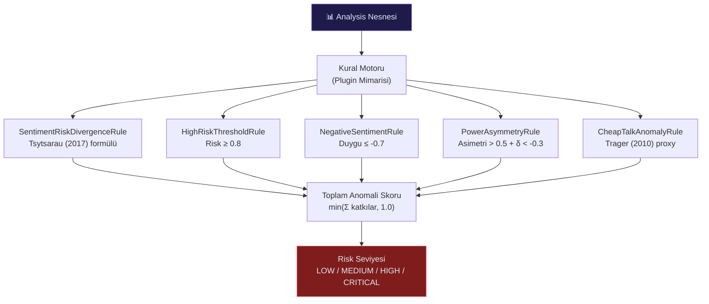

#### Tsytsarau Çelişki Formülü
$$C = \frac{n \cdot M_2 - M_1^2}{\left(\vartheta \cdot n^2 + M_1^2\right) \cdot W}$$

Burada:
- $M_1 = \frac{1}{n}\sum p_i$ (ortalama polarite)
- $M_2 = \frac{1}{n}\sum p_i^2$ (ikinci moment)
- $\vartheta = 0.1$ (regularizasyon)
- $W = n$ (ağırlıklandırma)

Negasyon düzeltmesinden sonra $C_{\text{adj}} > 0.1$ ise `SENTIMENT_RISK_DIVERGENCE` anomalisi tetiklenir.

**Anomali Türleri (v1.0.0):**
| Anomali | Tetikleyici Koşul | Kategori |
|---------|-------------------|----------|
| `RISK_HEDGING_CONFLICT` | Risk ≥ 7 AND Hedge ≥ 0.6 | Deception Pattern |
| `NEGATIVE_CONFRONTATIONAL_AMPLIFICATION` | Duygu ≤ -0.5 AND Ton = confrontational | Agresif Söylem |
| `VELVET_GLOVE_CONFRONTATION` | Duygu ≥ 0.3 AND Ton = confrontational | Örtülü Baskı |
| `HIGH_RISK_CONCILIATORY_MASK` | Risk ≥ 7 AND Ton = cooperative | Deception Pattern |
| `DIRECT_MANIPULATION_LOW_HEDGE` | Manip ≥ 0.7 AND Hedge ≤ 0.2 | Manipulation |
| `DOMINANT_ACTOR_PRESSURE` | Güç ≥ 8 AND SBI ≥ 7 AND Risk ≥ 6 | Power Dynamics |
| `VAGUE_DEMAND_PLAUSIBLE_DENIABILITY` | Hedge ≥ 0.6 AND Risk ≥ 4 | Strategic Ambiguity |
| `CONFLICT_FRAME_POSITIVE_WRAP` | Frame=conflict AND Duygu ≥ 0.3 | Framing Strategy |
| `INCONSISTENCY_PLUS_MANIPULATION` | Manip ≥ 0.5 AND \|AI−Formül\| ≥ 0.5 | Deception Pattern |
| `NEGATIVE_APPRAISAL_PERSUASIVE_TONE` | Appraisal=neg AND Duygu ≤ -0.5 AND Kibarlık ≥ 0.6 | Persuasion Strategy |

---

### 5.6 Konu Modellemesi (`TopicService`)

| Yöntem | Kullanım Amacı |
|--------|---------------|
| TF-IDF + Anahtar Kelime | Segment düzeyinde baz konu sıralaması |
| BERTopic | Tematik drift tespiti için semantik kümeleme |

**Konu Kategorileri (v1.0.0):**
`Gazze_Filistin_İsrail` · `Ukrayna_Rusya` · `BM_Reformu` · `Ekonomi_Ticaret_Enerji` · `Güvenlik_Çatışma`

---

### 5.7 Zamansal Drift Analizi (`TemporalAnalyzer`)

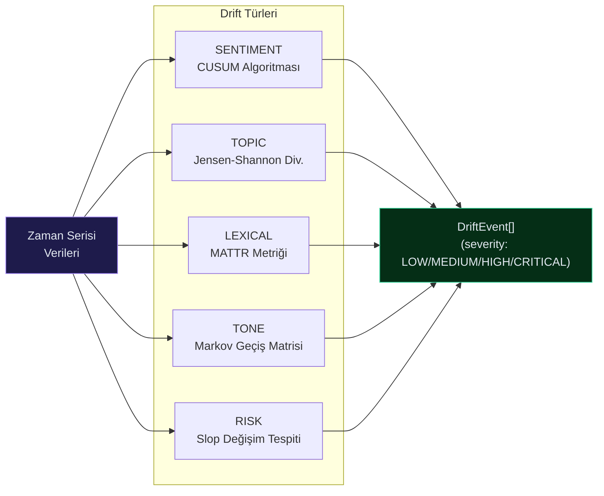

#### CUSUM Duygu Drift Tespiti
$$\text{CUSUM}^+_t = \max\!\left(0,\; \text{CUSUM}^+_{t-1} + z_t - k\right)$$
$$\text{CUSUM}^-_t = \min\!\left(0,\; \text{CUSUM}^-_{t-1} + z_t + k\right)$$

#### Jensen-Shannon Divergence (Konu Drift)
$$\text{JSD}(P \| Q) = \frac{1}{2} D_{\text{KL}}(P \| M) + \frac{1}{2} D_{\text{KL}}(Q \| M)$$

#### Ek İstatistiksel Metrikler (v1.0.0)
| Metrik | Formül / Yöntem | Açıklama |
|--------|----------------|----------|
| **MTLD** | Type-Token Ratio stabilizasyon noktası | Sözcük çeşitlilik zenginliği |
| **GARCH(1,1)** | $\sigma^2_t = \omega + \alpha\varepsilon^2_{t-1} + \beta\sigma^2_{t-1}$ | Duygu oynaklık rejimi |
| **Entity Half-Life** | $f(t) = f_0 \cdot e^{-\lambda t}$ | Varlık saliency bozunumu |
| **Lexical Entropy** | $H = -\sum p_i \log_2 p_i$ | Shannon entropi (sözcük dağılımı) |
| **Red Line Flexibility** | Concession Count / Red Line Count | Kırmızı çizgi geri adım indeksi |

---

## 6. Analiz Çıktıları ve Metrik Hesaplamaları

Sistemdeki verilerin ham halden global endekslere nasıl dönüştüğünü gösteren metrik hiyerarşisi:

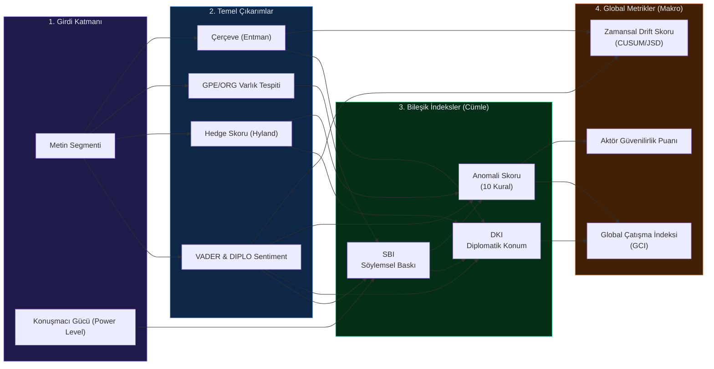

> [!NOTE]
> Temel çıkarımlardan hesaplanan bileşik indeksler (SBI, DKI, Anomali Skoru), nihai analiz raporlarında konuşmacının veya oturumun genel profilini (Global Metrikler) belirlemede ağırlıklı olarak kullanılır.

---

## 7. Kalite Güvencesi ve HITL

Modelin sürekli öğrenmesi ve kalibre edilmesi için sisteme entegre bir **Human-in-the-Loop (HITL)** döngüsü ve kalite güvence altyapısı bulunur.

| Bileşen | Amaç |
|---------|------|
| `GoldenDataset` | 100 el-etiketli cümle (ground truth) |
| `QualityEvaluator` | DeepEval / özel puanlayıcı (altın kümeye karşı) |
| `UncertaintyScorer` | AI çıktısı başına entropi tabanlı güven puanlaması |
| `HumanReview` | Uzmanların AI analizlerini değerlendirdiği salt-okunur (immutable) referans modeli |
| `CalibrationService` | Uzman ve AI uyumunu (Cohen's Kappa, Macro-F1, SBI MAE) haftalık analiz eden servis |
| `FewShotInjector` | Uzman onaylı altın standart verileri LLM istemlerine (prompt) otomatik enjekte eden modül |

### 7.1 Belirsizlik Puanlama (Uncertainty)

$$U = H(p) = -\sum_{c} p_c \log_2 p_c$$

Burada $p_c$ çıktının $c$ kategorisine ait olma olasılığıdır. Yüksek entropi ($U$) yüksek belirsizliği ifade eder ve bu durumda analiz otomatik olarak **Human Review (İnsan İncelemesi)** kuyruğuna düşer.

### 7.2 HITL (Human-in-the-Loop) İş Akışı

Aşağıdaki şema, yapay zeka analizinin alan uzmanları tarafından nasıl denetlendiğini, bu denetimlerin sistemi nasıl kalibre ettiğini ve AI'ın *few-shot learning* ile kendi kendini nasıl eğittiğini göstermektedir:

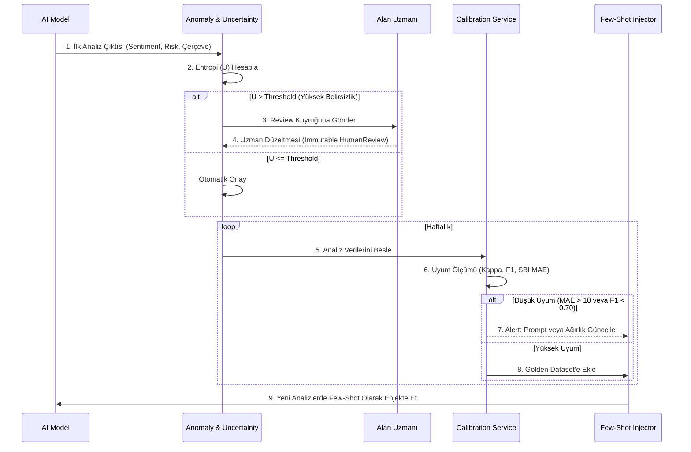

---

## 8. Altyapı

### 8.1 AI Backend Soyutlaması

```python
class AIClient(ABC):
    async def generate(self, prompt: str, **kwargs) -> str: ...
    async def embed(self, text: str) -> list[float]: ...

# Desteklenen backend'ler (v1.0.0)
class OllamaClient(AIClient): ...       # Yerel LLM (Llama3, Mistral vb.)
class AnthropicClient(AIClient): ...    # Claude (Haiku / Sonnet / Opus)
class GeminiClient(AIClient): ...       # Google Gemini (Flash / Pro)
class GroqClient(AIClient): ...         # Groq (hızlı çıkarım)
```

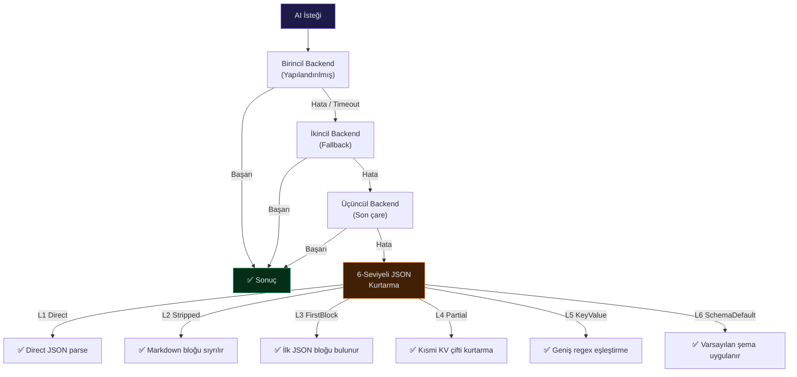

### 8.2 Önbellekleme Stratejisi

| Backend | Sürücü | TTL Stratejisi |
|---------|--------|---------------|
| Disk | `diskcache` | 24 saat (varsayılan) |
| Redis | `redis-py` | LRU + açık geçersiz kılma |

*Önbellek anahtarı: `SHA-256(prompt_text + model_version)` — prompt değişirse otomatik geçersiz.*

### 8.3 Veritabanı

| Bileşen | Teknoloji |
|---------|-----------|
| ORM | SQLAlchemy 2.0 (async) |
| Migrasyonlar | Alembic |
| Varsayılan | SQLite (geliştirme ortamı için) |

---

## 9. Gözlemlenebilirlik

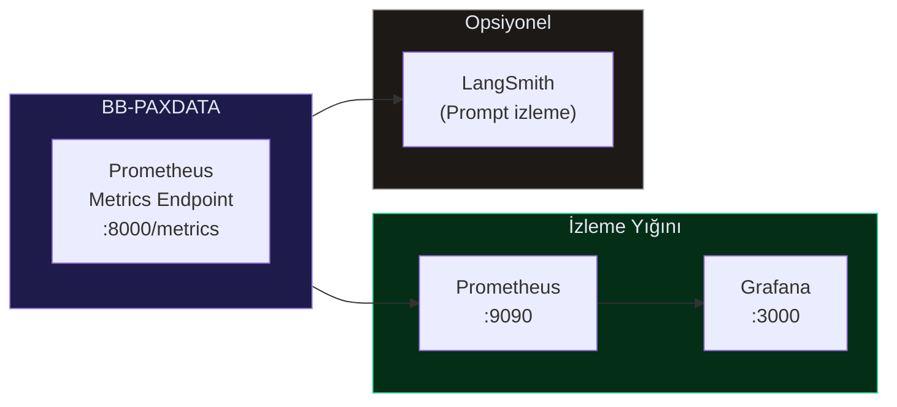

| Metrik | Tip | Etiketler |
|--------|-----|-----------|
| `ai_backend_latency_seconds` | Histogram | `backend`, `operation` |
| `cache_hit_rate` | Gauge | `backend` (disk/redis) |
| `batch_fallback_count` | Counter | `from_backend`, `to_backend` |
| `json_recovery_total` | Counter | `level`, `result` |

---

## 10. CLI Referansı

```
bbpaxdata [KOMUT] [SEÇENEKLER]

Komutlar:
  build        Transkriptleri veritabanına al
  analyze      Analiz pipeline'ını çalıştır
  failcheck    Anomali ve risk denetimi çalıştır
  validate     Veritabanı bütünlüğünü doğrula
  migrate      Legacy veritabanından veri taşı
  completions  Shell tamamlama kur/kaldır
  review       İnsan inceleme arayüzü

Ortak Bayraklar:
  --help       Yardım göster
  --verbose    Ayrıntılı çıktı
  --dry-run    Değişiklik yapmadan simüle et
```

---

## 11. Bilimsel Metodoloji

### 11.1 Yöntem Özeti

| Modül | Yöntem | Akademik Temel |
|-------|--------|----------------|
| **Sentiment** | Negasyon-farkında DIPLO + VADER | Jia & Liang (2017); Socher et al. (2013) |
| **Risk** | SBI / DKI bileşik indeks | Baldwin (1985); Kıyılar (2020) |
| **Hedging** | Hyland (1995) taksonomisi + yoğunluk oranı | Hyland (1995, 2005) |
| **Framing** | Entman (1993) dört-fonksiyonlu model + salience | Entman (1993) |
| **Anomaly** | 10 kurallı çapraz-anomali tensörü | Tsytsarau et al. (2017); Trager (2010) |
| **Topic** | TF-IDF + BERTopic dinamik modelleme | Grootendorst (2022) |
| **Dependency** | spaCy SVO çıkarımı + diplomatik alan budama | Manning et al. (2014) |
| **Explainability** | SHAP + LIME hibrit | Lundberg & Lee (2017); Ribeiro et al. (2016) |
| **Temporal** | CUSUM + JSD lexical drift + embedding centroid kayması | Page (1954); Lin (1991) |
| **Quality** | Tahmine dayalı entropi + ensemble anlaşmazlığı | Gal & Ghahramani (2016) |

### 11.2 Veri Akışı — Bilimsel Katmanlar

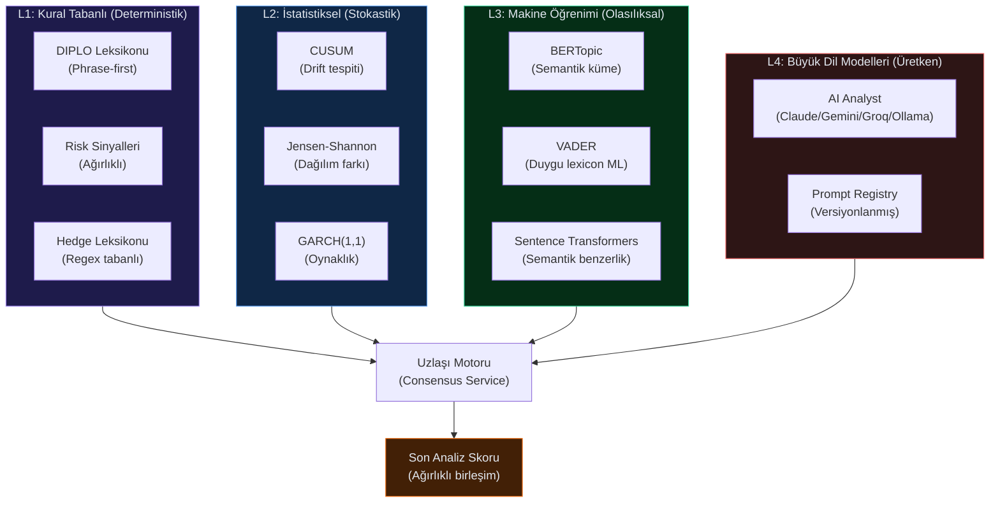

---

## 12. Akademik Kaynaklar

> Aşağıdaki kaynaklar v1.0.0'de doğrudan uygulanan veya referans alınan çalışmalardır.

### Duygu Analizi
- **Socher, R., Perelygin, A., Wu, J. et al. (2013).** *Recursive Deep Models for Semantic Compositionality Over a Sentiment Treebank.* EMNLP 2013.
- **Jia, L., & Liang, J. (2017).** *Negation and Speculation Scope Detection.* Chinese National Conference on Computational Linguistics.
- **Hutto, C.J., & Gilbert, E.E. (2014).** *VADER: A Parsimonious Rule-based Model for Sentiment Analysis of Social Media Text.* ICWSM.

### Risk ve Diplomatik Güç
- **Baldwin, D.A. (1985).** *Economic Statecraft.* Princeton University Press.
- **Fearon, J.D. (1995).** *Rationalist Explanations for War.* International Organization, 49(3), 379–414.
- **Trager, R.F. (2010).** *Diplomatic Calculus in Uncharted Territory.* American Political Science Review, 104(2), 347–371.

### Çit (Hedge) Dili
- **Hyland, K. (1995).** *The Author in the Text: Hedging Scientific Writing.* Hong Kong Papers in Linguistics and Language Teaching, 18, 33–42.
- **Hyland, K. (2005).** *Metadiscourse: Exploring Interaction in Writing.* Continuum.

### Çerçeveleme Analizi
- **Entman, R.M. (1993).** *Framing: Toward Clarification of a Fractured Paradigm.* Journal of Communication, 43(4), 51–58.

### Anomali Tespiti
- **Tsytsarau, M., Palpanas, T., & Denecke, K. (2017).** *Identifying Sentiment-based Contradictions.* Data Science and Engineering, 2, 81–97.

### Zamansal Drift ve İstatistik
- **Page, E.S. (1954).** *Continuous Inspection Schemes.* Biometrika, 41(1/2), 100–115.
- **Lin, J. (1991).** *Divergence Measures Based on the Shannon Entropy.* IEEE Transactions on Information Theory, 37(1), 145–151.
- **Covington, M.A., & McFall, J.D. (2010).** *Cutting the Gordian Knot: The Moving-Average Type–Token Ratio (MATTR).* Journal of Quantitative Linguistics, 17(2), 94–100.
- **Bollerslev, T. (1986).** *Generalized Autoregressive Conditional Heteroskedasticity.* Journal of Econometrics, 31(3), 307–327.

### NLP Altyapı
- **Volansky, V., Ordan, N., & Wintner, S. (2015).** *On the Features of Translationese.* Literary and Linguistic Computing, 30(1), 98–118.
- **Grootendorst, M. (2022).** *BERTopic: Neural topic modeling with a class-based TF-IDF procedure.* arXiv:2203.05794.
- **Lundberg, S.M., & Lee, S.I. (2017).** *A Unified Approach to Interpreting Model Predictions.* NeurIPS 2017.
- **Ribeiro, M.T., Singh, S., & Guestrin, C. (2016).** *"Why Should I Trust You?": Explaining the Predictions of Any Classifier.* KDD 2016.
