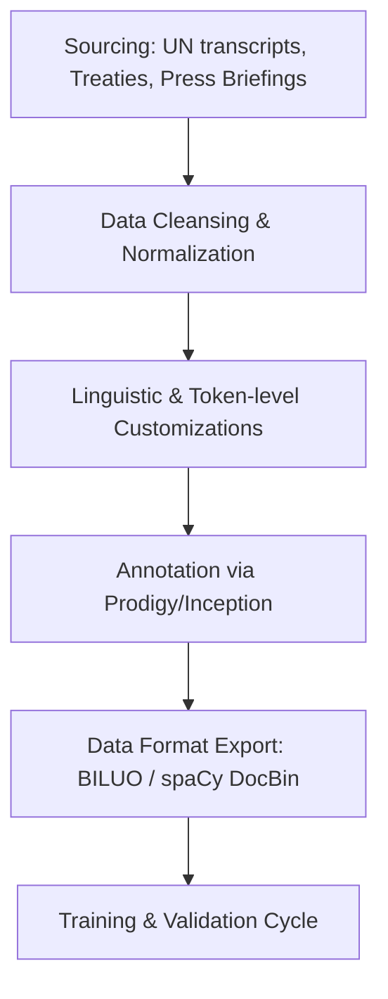

# BB-PAXDATA: spaCy Fine-Tuning Roadmap for Diplomatic Domain Analysis

This document outlines the limitations of general-purpose spaCy models (`en_core_web_sm`, `tr_core_news_md`) when processing diplomatic communication and details a comprehensive roadmap for fine-tuning these models to achieve high-precision domain performance.

---

## 1. Context and Motivation

In the BB-PAXDATA platform, word-level features (`lemma`, `pos_tag`, `dep_label`, `entity_type`, `is_negated`, `is_hedge`, `is_diplomatic_term`) form the foundation of downstream analysis, including:

- **Discourse Network Analysis (DNA)**: Mapping geopolitical entities and actors.
- **Rhetorical Pattern Recognition**: Flagging concessions, hedging, and escalation signals.
- **Formula-based Logic Checks**: Comparing LLM semantic scores against rule-based syntactic/lexical features.

General-purpose spaCy models are trained on standard web, news, and conversational corpora (e.g., OntoNotes, ClearNLP). Consequently, they struggle with the unique lexical, syntactical, and stylistic nuances of diplomatic transcripts and international treaties.

---

## 2. Model Limitations in the Diplomatic Domain

Standard models exhibit systematic errors across four primary areas:

### A. Geopolitical Entities (GPE) and Locations

- **Complex Multi-Word Boundaries**: Entities like `"the Holy See"`, `"Gaza Strip"`, `"United Nations Security Council"`, or `"Autonomous Republic of Crimea"` are frequently mis-segmented (e.g., labeling only `"Crimea"` or `"Gaza"` as GPE and leaving the rest as `O` or misclassifying them as `ORG`).
- **Metonymy**: In diplomatic speech, capital cities or administrative buildings represent governments (e.g., `"Washington decided..."`, `"Ankara responds..."`, `"the Kremlin warns..."`). General NER models often classify these strictly as `GPE` or `LOC`, missing the functional shift where they act as actors (`ORG` or `PERSON` equivalents).
- **Historical/Disputed Regions**: Names of historical regions or translation variants (e.g., `"Macedonia"`, `"Nagorno-Karabakh"`) lack consistent mappings.

### B. Political and Diplomatic Actors (PERSON)

- **Honoric and Hierarchical Titles**: Titles preceding names (e.g., `"Under-Secretary-General DiCarlo"`, `"Ambassador-at-Large"`, `"Chargé d'Affaires"`, `"His Excellency Mr. President"`) confuse standard segmenters and NER models. They often include the title within the `PERSON` boundary or fail to identify the name entirely.
- **Non-Western/Transliterated Names**: Multi-part transliterated names from Arabic, Chinese, Russian, or Turkish are prone to boundary errors.

### C. Latin Jargon and Multi-Word Expressions

- Diplomatic texts frequently employ Latin phrases to establish legal boundaries or status. Standard tokenizers and POS taggers fragment these, and lemmatizers fail to map them to their base semantic forms:
  - **Examples**: `ad hoc`, `status quo`, `de facto`, `de jure`, `pacta sunt servanda`, `mutatis mutandis`, `persona non grata`, `inter alia`.
  - **Issue**: `ad hoc` is often tokenized as two words: `ad` (ADP) and `hoc` (NOUN/PRON), destroying the unified phrase logic needed for rule-based analysis.

### D. Domain-Specific Diplomatic Lexicons

- Specialized terms like `demarche`, `communiqué`, `détente`, `rapprochement`, `suzerainty`, and `note verbale` are frequently misclassified under standard POS taggers (often categorized as unknown proper nouns `PROPN` or simple nouns `NOUN`), preventing correct dependency parsing and semantic mapping.

---

## 3. Data Strategy & Curation

Fine-tuning requires high-quality, domain-specific corpora. A structured data pipeline must be established:



### Data Sourcing

1. **UN Digital Library**: Official transcripts of the UN Security Council (UNSC) and General Assembly (UNGA).
2. **Treaty Collections**: UN Treaty Series, bilateral trade agreements, and peace treaties.
3. **Press Briefings**: Official state department briefings (e.g., US State Department, Turkish Ministry of Foreign Affairs).

### Custom Tokenization Rules

Before training, tokenizer rules must be injected to prevent the splitting of Latin jargon and common diplomatic acronyms:

```python
import spacy
from spacy.symbols import ORTH

def customize_tokenizer(nlp):
    # Add exception rules to prevent splitting of Latin jargon
    special_cases = ["ad hoc", "de facto", "de jure", "status quo", "inter alia"]
    for case in special_cases:
        nlp.tokenizer.add_special_case(case, [{ORTH: case}])
    return nlp
```

---

## 4. Annotation Strategy & Labeling Format

To maximize training efficiency, we use **Active Learning** alongside the **BILUO** labeling scheme for named entities.

### BILUO Scheme vs. IOB

While `IOB` (Inside, Outside, Beginning) is standard, spaCy strongly recommends **BILUO** (Beginning, Inside, Last, Unit, Outside) for training its NER parser because it explicitly encodes boundary tokens.

| Token  | Character Offset | Entity Label    | BILUO Tag         | Description                         |
| ------ | ---------------- | --------------- | ----------------- | ----------------------------------- |
| The    | 0-3              | -               | O                 | Outside                             |
| Holy   | 4-8              | GPE             | B-GPE             | Beginning of multi-word GPE         |
| See    | 9-12             | GPE             | L-GPE             | Last token of multi-word GPE        |
| signed | 13-19            | -               | O                 | Outside                             |
| an     | 20-22            | -               | O                 | Outside                             |
| ad hoc | 23-29            | DIPLOMATIC_TERM | U-DIPLOMATIC_TERM | Unit (single-token) diplomatic term |
| treaty | 30-36            | -               | O                 | Outside                             |
| .      | 36-37            | -               | O                 | Outside                             |

### Tooling

- Use **Prodigy** (developed by Explosion, creators of spaCy) to run active-learning-assisted annotations.
- Define custom patterns for diplomatic terms and GPEs to bootstrap annotation speeds (weak supervision).

---

## 5. Training and Optimization Cycle

```
[Pre-trained Model] -> [Custom NER/Parser Components] -> [Optimization via GPU] -> [Evaluation]
```

### Config Setup (`config.cfg`)

We configure a multi-stage training pipeline targeting both language models (TR/EN).

```ini
[nlp]
pipeline = ["tok2vec", "tagger", "parser", "ner", "attribute_ruler", "lemmatizer"]
batch_size = 256

[training]
accumulate_gradient = 1
dev_corpus = "corpora/dev.spacy"
train_corpus = "corpora/train.spacy"

[training.optimizer]
@optimizers = "Adam.v1"
beta1 = 0.9
beta2 = 0.999
L2 = 0.01
```

### Iterative Training Loop

1. **Freeze Core Components**: Freeze the base token weights (`tok2vec`) during initial epochs to retain syntactic knowledge.
2. **Train custom components**: Train the `ner` parser and POS `tagger` components using the customized annotated datasets.
3. **Prevent Catastrophic Forgetting**: Mix a small percentage (15-20%) of general-purpose web text back into the training data to ensure the model does not lose its broad linguistic capabilities.

### Evaluation Metrics

We evaluate model success using a dedicated holdout test dataset containing diplomatic text:

- **NER Precision/Recall/F1-Score**: Target $F1 \ge 0.92$ on `GPE`, `PERSON`, and custom `DIPLOMATIC_TERM`.
- **POS Tagging Accuracy**: Target accuracy $\ge 96\%$ on Latin phrases and specialized verbs.
- **Lemmatization Accuracy**: Ensure Latin nouns and adjectives map to unified lemmas (e.g., `de facto` -> `de_facto`).
